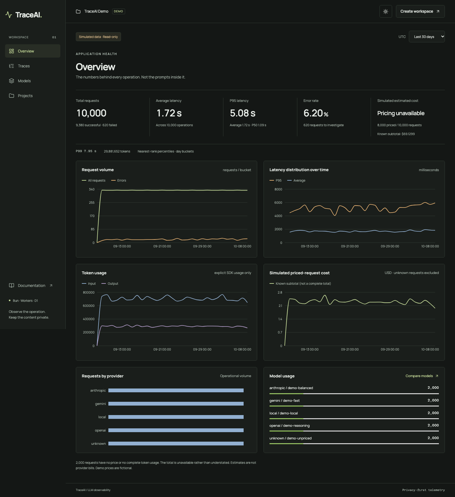

# TraceAI

[](https://github.com/Metricra-code/traceai/actions/workflows/ci.yml)

A privacy-first LLM observability portfolio: a standalone TypeScript SDK, a usable React dashboard,
and project-scoped analytics on Cloudflare Workers/D1. No paid AI credentials are needed.

**[Open the live read-only demo](https://traceai-web.traceai-api.workers.dev/demo)** ·
[API health](https://traceai-api.traceai-api.workers.dev/health) ·
[GitHub source](https://github.com/Metricra-code/traceai)



Verified locally and live: **168 unit tests**, **73 actual Worker/D1 integration cases**, and
**17 Playwright journeys in each of native Next, built-workerd and deployed HTTPS modes**.
The live SDK + genuine OpenTelemetry → Worker → D1 smoke also verifies sourced pricing, privacy,
deduplication and revoked keys. Current publication CI is a separate pending release gate;
see [verification](docs/verification.md) and the workflow badge, not build success alone.

## What to explore

- **SDK engineering:** original async results/errors preserved; bounded batching, full-jitter retry,
  timeouts, `flush()` singleflight, deterministic shutdown and acknowledged completed-event receipts.
  [Design, concurrency benchmark and tests](docs/sdk.md).
- **Dashboard:** real API-backed Average/P95, request/latency/token/cost charts, provider-qualified model
  comparison, exact trace search, server-side filters, cursor pagination and safe operation detail.
  Persistent themes, keyboard account menu and responsive loading/error/empty states are usable.
- **Management:** email/password sessions, owned projects, one-time ingestion keys, rotation/revocation
  and confirmed deletion. Keys never belong in a browser bundle.
- **Public demo:** 10,000 deterministic simulated traces, clearly labeled fictional prices,
  working filters and detail pages, no authentication or write privileges.
- **Sourced pricing/debugging:** immutable verified base-text snapshots, per-trace provenance and
  explicit opt-in redacted error summaries. Unknown prices stay unknown; estimates are not bills.
- **Optional OpenTelemetry:** genuine GenAI `SpanExporter` with actual span IDs/timing, privacy
  allowlist and honest delivery lifecycle. [Free real-provider example](docs/opentelemetry.md).
- **Engineering evidence:** architecture diagram, strict TypeScript, Vitest, actual Worker/D1 integration,
  Playwright journeys and GitHub Actions. [Evidence and outstanding checks](docs/verification.md).

## Run locally

Requirements: **Bun 1.4.0 and Node >=22** for supported Cloudflare/tooling CLIs.
Bun owns installation, workspaces, scripts, the local Next runtime and TypeScript examples;
production executes in Cloudflare workerd. Use `bun run test` for Vitest, not the separate `bun test` runner.
Next is pinned to **16.3.8** with OpenNext **1.20.9**: 16.4 adds a manifest the adapter does not yet
inline ([upstream compatibility fix](https://github.com/opennextjs/opennextjs-cloudflare/pull/1356)).
Keep the pin until a released adapter passes actual workerd dynamic-route checks; build success alone
did not catch this regression.

```sh
bun install --frozen-lockfile
bun run db:migrate
bun run db:pricing --local
bun run db:seed
bun run dev
```

Open [the read-only demo](http://localhost:3000/demo), then choose **Last 30 days** to see all 10,000 traces.
[Create an account](http://localhost:3000/register), create a project, and generate an ingestion key to
try the real SDK → Worker → D1 path. Follow [SDK integration](docs/sdk.md) for the mock-provider example.
[Worker health](http://127.0.0.1:8787/health) confirms the local D1 connection.

The seed is simulated, not an AI benchmark or production traffic. Normal ingestion never uses demo prices;
the operator-imported [sourced pricing registry](docs/pricing.md) supplies verified base text-token rates;
unknown models or incomplete usage return `null` costs rather than misleading `$0` values.
The separately labeled priced-only subtotal excludes unknown prices and is never a complete grand total.

## Validate

```sh
bun run format:check
bun run lint
bun run typecheck
bun run test
bun run test:integration
bun run build
bun run test:packages
bunx --no-install playwright install chromium
bun run test:e2e
bun run --filter @traceai/web build:cloudflare
bun run test:e2e:workers
```

Migrations/demo seed are required before local E2E. `test:e2e:workers` checks the built OpenNext app
in actual workerd, not Next development mode. CI runs both paths without automatic deployment;
failed Playwright runs retain trace/report artifacts. Test source is not proof that its current run passed.

## Architecture and boundaries

- `apps/web`: Next.js App Router, React Query, TanStack Table, Recharts and a same-origin API proxy.
- `apps/api`: Hono routes → services → D1 repositories; private password-hashing Durable Object.
- `packages/sdk`: framework-independent public ESM package; Zod is its only runtime dependency.
- `packages/opentelemetry`: optional server-side GenAI exporter; the core SDK has no OTel dependency.
- `packages/shared`: strict Zod contracts, nearest-rank percentiles and integer monetary arithmetic.
- `packages/database`: Drizzle schema, indexed D1 migrations and deterministic demo seed.
- `examples`: native-Bun mock operations, genuine OTel provider and reproducible SDK overhead benchmark.

Passwords use native scrypt in a **private SQLite-backed Durable Object**, not weakened edge PBKDF2.
Session cookies are HttpOnly/SameSite and Secure in production. Every private analytics/management request
checks ownership; cookie mutations validate Origin. No prompts, responses or raw original errors are
captured by default. Explicit metadata/summaries remain your privacy responsibility; sanitization is
best-effort, not an arbitrary-PII guarantee. Ingestion keys are temporarily revealed once in Settings,
never embedded in bundles or persisted in client storage. Only expired auth state is removed by
bounded maintenance; user traces remain until confirmed project deletion.

## Documentation and limits

[Architecture](docs/architecture.md) · [SDK](docs/sdk.md) · [API](docs/api.md) · [Demo](docs/demo.md) ·
[Deployment](docs/deployment.md) · [Verification](docs/verification.md) · [Requirements](docs/product-spec.md) ·
[Acceptance ledger](docs/acceptance.md) · [Troubleshooting](docs/troubleshooting.md) · [Operations](docs/operations.md) ·
[Pricing](docs/pricing.md) · [OpenTelemetry](docs/opentelemetry.md) · [Roadmap](docs/roadmap.md) ·
[面試展示導覽](docs/interview-guide.md)

[GitHub source](https://github.com/Metricra-code/traceai). The full specified product is a portfolio,
not an enterprise SLA:
SDK delivery is in-memory/best-effort; analytics reject windows over 31 days or 20,000 matching rows;
Free-tier quotas require monitoring. No automatic deployment, paid AI dependency, model-quality claims,
password reset/MFA, OTLP collector, metrics/log backend or distributed span tree.
Public SDK/exporter packages are buildable and verified as tarballs, **not published to npm**.
