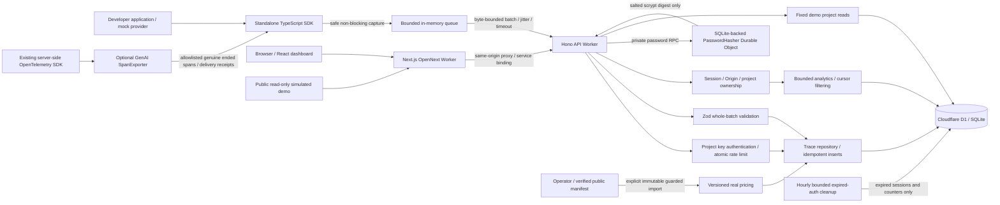

# Architecture

The web/API Workers are deployed: [web demo](https://traceai-web.traceai-api.workers.dev/demo),
[API health](https://traceai-api.traceai-api.workers.dev/health). The standalone SDK and optional OTel
exporter are client packages verified against those Workers, not additional hosted collectors.
Current built-workerd/live-browser and real SDK/OTel → D1 evidence is recorded separately from
published-source CI in [verification](verification.md).

## Responsibilities and trust boundaries

- SDK knows neither React nor application return shapes. It captures only labels, time, categories,
  optional usage and explicit scalar metadata. Telemetry errors cannot replace an operation's result/error.
- HTTP routes validate input and enforce authentication. Services own lifecycle, authorization, costs and
  analytics semantics. Repositories own parameterized D1 access. Shared contracts have no persistence dependency.
- The browser uses `/api/*` on its own origin. The Next proxy forwards approved routes and necessary cookies/Origin
  to the API; production uses a Cloudflare service binding. No ingestion key is stored in frontend code.
- Management reads/writes require the authenticated project owner. Missing/non-owned resources both return 404;
  cookie mutations require the configured web Origin. Public demo reads always use project `demo`, never a query-supplied ID.
- Sessions use random tokens, hashed-at-rest IDs, seven-day expiration, HttpOnly/SameSite cookies and production Secure.
  API keys are independently salted, random 256-bit credentials; only a hash/prefix is stored and raw values are shown once.
- Prompts, responses, authentication headers and original exception messages are never automatically ingested.
  An explicit failure-only summary callback/input passes bounded known-pattern redaction in SDK and server.
  Only stored summaries with `explicit-summary-v1` are exposed, and they are sanitized again on read;
  legacy unmarked `error_message` values remain private. Custom metadata/summaries must not contain PII/secrets;
  regex redaction is defense-in-depth, not an arbitrary-data privacy guarantee.
- OpenTelemetry is an optional exporter package, not a collector. It maps real completed GenAI span time/identity,
  operation/provider/model and validated token counts; arbitrary resources/events/status descriptions/span names
  are excluded. Explicit mappers are bounded and validated. Export callbacks reflect HTTP acknowledgements or
  drops, never assume that enqueue/flush alone proved persistence. Existing SDK → API → D1 verification checks
  real storage separately.

## Password runtime decision

The edge Worker calls a **private SQLite-backed Durable Object** to execute native `scryptSync`.
Parameters are fixed at `N=32768`, `r=8`, `p=3`, with a random 16-byte salt and constant-time verification.
This is the 32 MiB profile listed in [OWASP password storage guidance](https://cheatsheetseries.owasp.org/cheatsheets/Password_Storage_Cheat_Sheet.html#scrypt).
Only the versioned salted digest is persisted in D1; the Durable Object does not persist passwords.

SQLite-backed Durable Objects are eligible on Free and have a default 30-second CPU allowance,
unlike the constrained edge request budget. This boundary avoids lowering a secure work factor to fit
edge PBKDF2 limits. Rate limits precede hashing, and stable shards bound per-object contention.
[Cloudflare Durable Object limits](https://developers.cloudflare.com/durable-objects/platform/limits/).
This is a runtime/resource trade-off, not proof of unlimited throughput or zero-cost operation at any traffic level.

## Persistence and analytics

- Unique `(project_id, trace_id)` makes replayed ingestion idempotent. D1 batch transactions roll back every
  insert if a later statement fails. Five-row insert chunks stay within statement bind limits.
- Composite project/time, project/status/time and project/provider/model/time indexes support scoped queries.
- Analytics use UTC `[from,to)` windows of at most 31 days. Narrow projections read at most 20,001 candidates:
  more than 20,000 matches returns 422 rather than reporting truncated P95.
- P50/P95/P99 use deterministic nearest rank, `ceil(p × n)`. Metrics use zero-filled UTC hour/day buckets;
  the UI shows latency gaps when a bucket has no observations.
- Trace lists use stable `(started_at, trace_id)` keyset pagination. Cursors are versioned and bound to project,
  window, filters and sort; they are not authorization credentials or snapshot-isolation guarantees.
- Pricing uses effective, versioned real registry entries. Calculation/aggregate sums use BigInt nanodollars;
  D1 individual values are safe integers, and API amounts are decimal strings. Any unpriced row makes the
  aggregate total null, with explicit priced/unpriced counts. The separately labeled known subtotal sums
  priced requests only (null if a nonempty set is entirely unpriced); it never stands in for a grand total.
  Demo prices cannot price normal ingestion.
- The checked-in sourced registry has explicit verification/effective timestamps and billing basis. One-statement
  imports and D1 triggers reject mutable version IDs and overlapping windows atomically. Historical trace costs
  never change when a registry version is imported; [pricing](pricing.md) documents base-rate limitations.
- Scheduled maintenance deletes at most 250 expired sessions and 250 expired rate counters per hourly invocation.
  It never deletes user traces, keys, projects, accounts or price history. Only safe counts/failure categories are
  logged. [Operations](operations.md) defines quota checks, the no-hidden-trace-expiry policy and rollback.

## Deliberate trade-offs

SDK delivery is best-effort, not durable: abrupt termination can lose queued events. Retried attempts reuse
trace IDs/body; database deduplication does not imply exactly-once delivery. Overflow drops newest telemetry
instead of backpressuring application work. Explicit flush/shutdown and safe diagnostics make loss observable.

There are no collectors, Redis/Kafka, paid AI calls, nested-span tree or WebSocket updates. The optional
OpenTelemetry exporter does not imply OTLP ingress or metrics/log storage. No model-quality claims are inferred
from operational latency. Email verification/password recovery/MFA and automatic trace archival/expiry remain
outside the delivered scope. See [deployment](deployment.md) for quotas, lifecycle and live checks.
