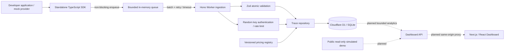

# Architecture

## Implemented core and planned UI

Solid ingestion path is the core slice; dashed Dashboard paths are planned, not claimed implemented. Next.js has a runnable foundation scaffold.

## Boundaries

- SDK does not know React/Next, D1 or application return shapes. Custom usage is explicit.
- `shared` defines HTTP payload schemas and domain contracts, not persistence.
- HTTP routes handle authentication, body bounds and status codes. Services own security/rate/cost behavior. Repositories own Drizzle/D1 access.
- API keys are project-scoped, cryptographically random and stored only as salted hashes. The credential's public key ID supports indexed lookup.
- Unique `(project_id, trace_id)` prevents retries from creating duplicate operations.
- Privacy boundary: no raw prompts, responses, headers or original error messages. Metadata is opt-in and bounded; callers remain responsible for avoiding PII.
- Monetary arithmetic is BigInt-based integer nanodollars. D1 stores safe integers, API serializes decimal strings. Unknown prices remain null.
- Demo prices are simulated and explicitly excluded from normal ingestion.

## Reliability trade-offs

Delivery is best-effort, bounded memory, not durable. A crashed process can lose unsent events. Retried HTTP batches are at-least-once attempts, while database writes are idempotent. Queue overflow drops events with safe diagnostics instead of applying application backpressure. `flush`/`shutdown` are explicit lifecycle boundaries; serverless callers must await them within their allowed lifetime.

No Redis, Kafka, collectors or paid AI services. OpenTelemetry stays on the roadmap until the core experience is accepted.

## Security / runtime follow-ups

Cookie management APIs and account auth are not enabled in this slice. Workers PBKDF2 production caps and free CPU limits make secure email/password auth a decision requiring verified runtime support; do not quietly lower the work factor or claim security from local tests only. See [deployment](deployment.md).
